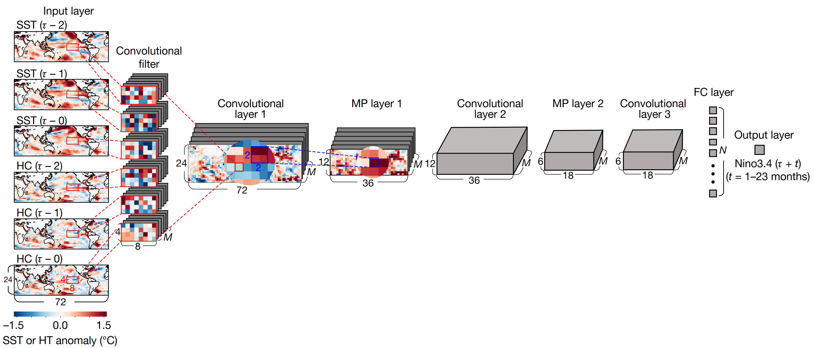
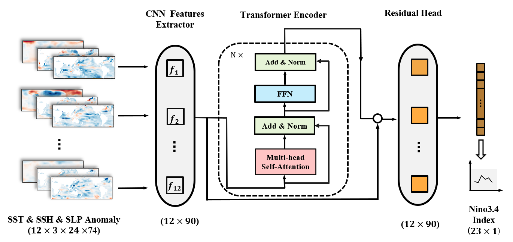
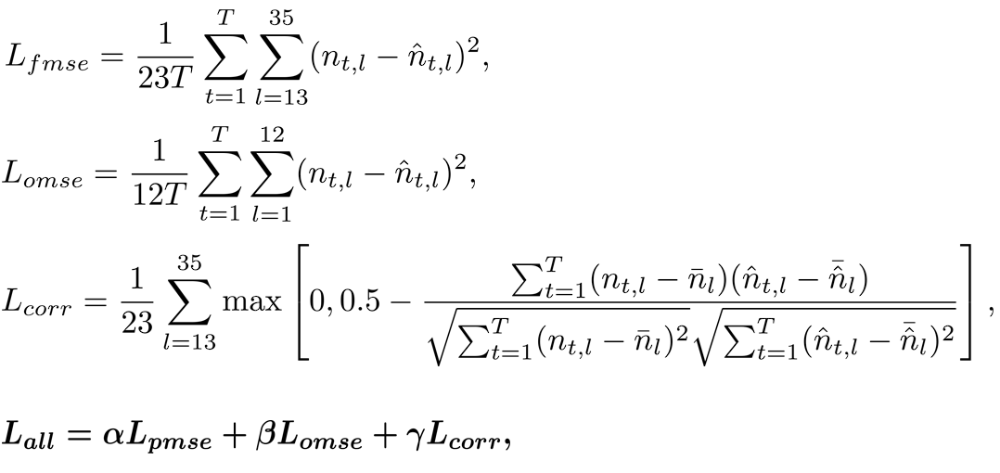

# CTEFNet: 基于 CNN 与迁移学习的厄尔尼诺预测模型

## 1 概述

### 1.1 原始论文

标题：Deep learning for multi-year ENSO forecasts  
doi: `https://doi.org/10.1038/s41586-019-1559-7`

> 文章介绍了一种基于深度学习的方法，可以有效地预测厄尔尼诺现象的发生，其预测时间可达一年半。本文研究者使用CNN模型结合历史模拟数据和再分析数据，成功地提取了与厄尔尼诺现象相关的特征信息。与传统的预测模型相比，该模型在预测厄尔尼诺的强度和类型方面表现出更高的准确率，并且能够识别导致不同类型厄尔尼诺事件的海表面温度信号。



文章提出的CNN深度学习模型具体构造如上图所示。其结构可以分为5个部分：

- 输入层： 包含海表温度 (SST) 和海洋热量含量 (HC) 异常图，范围为 0°-360°E 和 55°S-60°N，时间跨度为三个月。

- 卷积层： 三个卷积层，每个卷积层都包含多个卷积核，用于提取输入数据中的局部特征。

- 最大池化层： 两个最大池化层，用于降低特征图的空间分辨率，减少模型参数数量，并提高模型的平移不变性。

- 全连接层： 一个全连接层，将特征图连接到一个或多个神经元，用于输出预测结果。

- 输出层： 包含预测变量，例如Nino3.4指数或El Niño类型。

该模型具备一些显著优势：

- 能够提取输入数据中的复杂特征： 卷积层可以自动学习输入数据中的复杂特征，例如SST和HC异常图中的空间模式。

- 具有平移不变性： 最大池化层可以降低特征图的空间分辨率，并使模型对输入数据的平移和变形具有鲁棒性。

- 能够处理大量数据： CNN模型可以使用大量数据进行训练，并从数据中学习复杂的模式。

CNN模型的成功应用表明，深度学习技术在气候预测领域具有巨大的潜力。

### 1.2 改进

论文当中给出的模型仅使用CNN作为主要模型架构，对于长时间的序列化预测任务CNN难以捕捉时间依赖性。ENSO事件的发生和发展通常需要数月甚至数年的时间，因此时间依赖性对于ENSO预测非常重要。Transformer Encoder具有自注意力机制，可以有效地捕捉时间序列数据中的时间依赖性，能更准确地预测ENSO事件的发生时间和强度。另外，Transformer Encoder具有强大的泛化能力，可以处理不同时间尺度的数据，其学习到的特征表示也更加丰富，因此考虑引入Transformer Encoder改进原模型。

CTEFNet是一种基于深度学习的 ENSO 预测模型，其使用 2D CNN 从气象数据中提取特征，将多个时点特征拼接为时间序列后输入 Transformer Encoder 进行时序分析和 ENSO 预测。
与之前的深度学习模型相比，CTEFNet的有效预测时长延长至19个月。

下图展示了CTEFNet的网络架构。



CTEFNet 主要由 CNN 特征提取器和 Transformer 编码器两部分组成。

CNN 部分包含三个卷积层、三个最大池化层；以连续 12 个月的海洋、大气指标月异常值作为输入。

提取出的特征排列为序列后将输入 Transformer 编码器进行序列分析，并与CNN构成残差结构，最后经过全连接层输出观测期 12 个月的Nino3.4 指数估计值及后续 23 个月的 Nino3.4 指数预测值。

## 工作

基于Jupyter Notebook运行训练与推理代码，通过MindEarth训练和快速推理模型。  

运行环境：华为ModelArts

镜像：`mindquantum0.9.0-mindspore2.0.0-cuda11.6-ubuntu20.04`  

配置：GPU: 1*Pnt1(16GB) | CPU: 8核 64GB  

## 技术路径

### 框架

1. MindSpore 2.0.0
2. MindEarth-GPU，通过pip安装：`pip install mindearth_gpu`

### 数据集

训练和测试所用的数据集可以在: [mindearth/dataset](https://download-mindspore.osinfra.cn/mindscience/mindearth/dataset/enso_dataset.zip) 下载。

将数据集置于项目根目录的`dataset`目录下。`./dataset`中的目录结构如下所示：

```
.
dataset
├── CMIP5_nino34.npy
├── CMIP5_sst_ssh_slp.npy
├── SODA_nino34.npy
└── SODA_sst_ssh_slp.npy
```

### 损失函数

CTEFNet 在模型训练中使用自定义加权损失。计算公式为：



### 运行结果

运行结果位于`summary`目录下。该目录下：

1. `results.log`记录运行了推理过程的日志。
2. `Forecast_Correlation_Skill.png`为最终的结果可视化图表。
3. `ckpt/step_1`目录下保存预训练结果，`ckpt/step_2`目录下保存调优结果。
